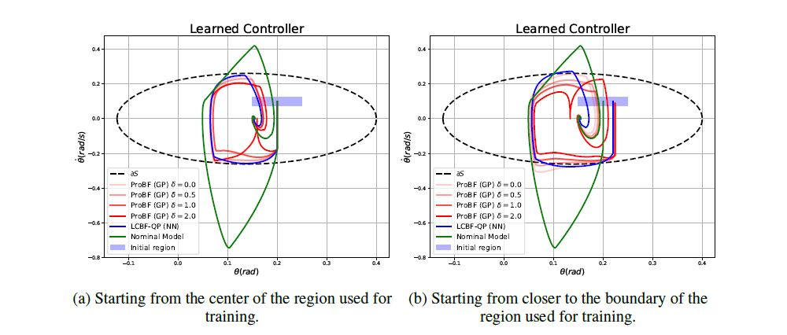

# ProBF
Implementation of Probabilistic Barrier Certificates submitted to NeuRIPS 2021 safeRL workshop.

This code compares the ProBF-GP framework with the prior art LCBF which uses a neural network. We build upon the code in [1].

### LCBF-NN
For running the LCBF, we use the tensorflow backbone provided by the authors of [2]. The environment used for running the code is listed in "tf_env.yml".
1.  segway_nn.py - Train the LCBF-NN with 10 different seeds and test each time on 10 seeds for the segway framework.
2.  quadrotor_nn.py - Train the LCBF-NN with 10 different seeds and test each time on 10 seeds for the quadrotor framework. 

### ProBF-GP ( Our approach )
For running the Pro-BF, we use gpytorch for GP training. The environment used for running the code is listed in "pytogpu.yml".
1.  segway_gp.py - Train the ProBF-GP with 10 different seeds and test each time on 10 seeds for the segway framework.
2.  quadrotor_gp.py - Train the ProBF-GP with 10 different seeds and test each time on 10 seeds for the quadrotor framework. 

# References
[1] Python simulation and hardware library for learning and control. https://github.com/learning-and-control/core.git. Accessed: 2021-11-17.

[2] A. Taylor, A. Singletary, Y. Yue, and A. Ames. Learning for safety-critical control with control
barrier functions. In Learning for Dynamics and Control, pages 708–717. PMLR, 2020.
